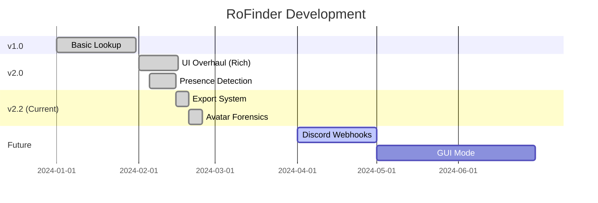

<div align="center">

# RoFinder v2


<p align="center">
  
</p>

<p align="center">
  <a href="https://github.com/robloxenjoyer124/rofinder/releases">
    
  </a>
  <a href="https://github.com/robloxenjoyer124/rofinder/stargazers">
    
  </a>
  <a href="https://github.com/robloxenjoyer124/rofinder/blob/main/LICENSE">
    
  </a>
  <a href="https://github.com/robloxenjoyer124/rofinder/commits/main">
    
  </a>
</p>

<p align="center">
  
  
  
</p>

<p align="center">
  <a href="#installation"><kbd> <br> Installation <br> </kbd></a>&ensp;&ensp;
  <a href="#usage"><kbd> <br> Usage <br> </kbd></a>&ensp;&ensp;
  <a href="#features"><kbd> <br> Features <br> </kbd></a>&ensp;&ensp;
  <a href="#exporting"><kbd> <br> Exporting <br> </kbd></a>
</p>

</div>

<br>

## About RoFinder

<table>
<tr>
<td width="60%">

**RoFinder v2** is a professional-grade OSINT (Open Source Intelligence) tool for Roblox. It is designed to extract deep user information, analyze avatar assets, track activity status, and generate detailed reports in milliseconds.

Featuring a beautiful **Cyberpunk CLI** interface powered by `rich`, RoFinder transforms raw API data into readable, actionable intelligence. It supports exporting data to **JSON** for developers and **TXT** for shareable reports.

</td>
<td width="40%">

```text
╔═══════════════════════════╗
║   Why Choose RoFinder?    ║
╠═══════════════════════════╣
║ ⚡ Real-Time Presence     ║
║ 🎨 Cyberpunk UI           ║
║ 📂 JSON/TXT Exporting     ║
║ 👔 Avatar Asset Scan      ║
║ 💎 Premium Detection      ║
║ 🔒 100% Safe (Read-Only)  ║
╚═══════════════════════════╝
```

</td>
</tr>
</table>

<br>

## Features

<details open>
<summary><b>🕵️ User Intelligence</b></summary>
<br>

<table>
<tr><td>

- **Robust Lookup:** Advanced `POST` method resolution (100% accurate User IDs).
- **Deep Profile:** Account age, creation date, bio analysis.
- **Status Checks:** Detects **Premium** subscription and **Verified** badges.
- **Reputation:** Banned status detection.

</td></tr>
</table>

</details>

<details open>
<summary><b>👁️ Presence & Activity</b></summary>
<br>

<table>
<tr><td>

- **Real-Time Status:** Detects if user is **Online**, **Offline**, **In-Game**, or in **Roblox Studio**.
- **Last Seen:** Exact timestamp of when they were last active.
- **Game History:** Scans user's Favorite Games list.

</td></tr>
</table>

</details>

<details open>
<summary><b>👚 Avatar Forensics</b></summary>
<br>

<table>
<tr><td>

- **Asset Scanner:** Lists every item the user is currently wearing.
- **Item IDs:** Returns Asset IDs for Hats, Shirts, Faces, and Accessories.
- **Thumbnails:** Fetches high-res avatar headshot URLs.

</td></tr>
</table>

</details>

<details open>
<summary><b>💾 Data Exporting</b></summary>
<br>

<table>
<tr><td>

- **Developer Ready:** Export full datasets to `.json`.
- **Report Mode:** Generate clean, readable `.txt` files for sharing.
- **Timestamps:** All exports include generation time for record keeping.

</td></tr>
</table>

</details>

<br>

## Installation

<div align="center">

### 1. Clone the Repository
```bash
git clone https://github.com/robloxenjoyer124/rofinder.git
cd rofinder
```

### 2. Install Dependencies
```bash
pip install -r requirements.txt
```

### 3. Run RoFinder
```bash
python rofinder.py --help
```

</div>

<br>

## Usage

<div align="center">

### ⚡ Quick Lookup
Get basic stats and ID.
```bash
python rofinder.py roblox
```

### 🔍 Detailed Intelligence
Fetches Badges, Groups, Avatar Items, and Favorites.
```bash
python rofinder.py roblox --detailed
```

### 💾 Generate Text Report
Saves a readable file `report.txt` to your folder.
```bash
python rofinder.py roblox --save report.txt
```

### 👨‍💻 Developer JSON Export
Dumps raw data for use in your own apps.
```bash
python rofinder.py roblox --detailed --save data.json --format json
```

</div>

<br>

## Screenshots / Demo

```text
 ____       _____ _           _           
|  _ \ ___ |  ___(_)_ __   __| | ___ _ __ 
| |_) / _ \| |_  | | '_ \ / _` |/ _ \ '__|
|  _ < (_) |  _| | | | | | (_| |  __/ |   
|_| \_\___/|_|   |_|_| |_|\__,_|\___|_|   

            By robloxenjoyer124

╭─ User Intelligence: Roblox ────────────────────────────────────────────────╮
│                                      │ Metric      │                 Value │
│  User:    @Roblox  ☑️  💎 PREM       │ Friends     │                   169 │
│  Display: Roblox                     │ Followers   │            12,405,102 │
│  ID:      1                          │ Following   │                     0 │
│  Status:  ● Online                   │ Banned      │                    No │
│  Seen:    2025-01-01 12:30           ╰─────────────┴───────────────────────╯
│  Age:     6345 days                                                         
│                                                                            
╰────────────────────────────────────────────────────────────────────────────╯
```

<br>

## Roadmap

<div align="center">



</div>

<br>

## License

<div align="center">

This project is licensed under the **MIT License**.

Copyright (c) 2024 **robloxenjoyer124**

</div>
